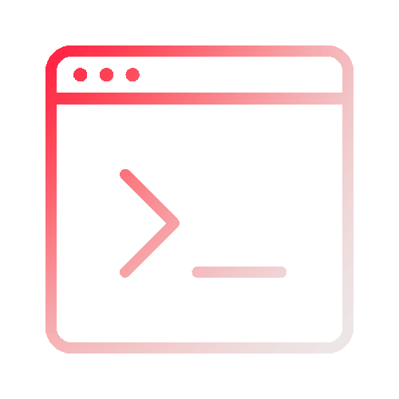

<h1 align="center" style="width: 20px">Desafio ToDo List 🚀</h1>
 

  

  

## 📌 Sobre o projeto

Desafio técnico do módulo de Fundamentos do ReactJS da trilha de ReactJS da Rocketseat, buscando reforçar os principais conceitos do React e suas principais ferramentas.

O desafio consiste na construção de uma aplicação de controle de tarefas no estilo to-do list.

> Instruções do desafio: 🔗 <a href="https://efficient-sloth-d85.notion.site/Desafio-01-Praticando-os-conceitos-do-ReactJS-91fd63dd1a5b4a2796152de293ec1074" target="_blank">Notion</a> 

### 🎨 Protótipo:

O protótipo do projeto pode ser acessado em: 🔗 <a href="https://www.figma.com/design/zKAGwyqMOA1y1XSCnIcGpa/ToDo-List-%E2%80%A2-Desafio-React?node-id=56-96&p=f&t=FvSWLSoDBSxI2y0U-0" target="_blank">Figma</a>

### ⚡ Funcionalidades:

- 📋 Listagem de Tarefas

- ➕ Adição de novas tarefas

- ❌ Exclusão de tarefas da listagem

- ✔ Marcar/Desmarcar tarefa como concluída

- 📍 Mostrar progresso de conclusão das tarefas

---

Projeto sendo desenvolvido com ♡ por <strong>Gabrieli Moreira</strong> 👩🏼‍💻

